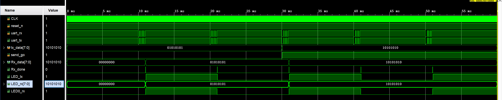

# UART Transceiver
## 功能
### 发送模块 (uart_tx)
- 支持9600波特率，可通过参数修改
- 数据位8位，1位停止位，无校验
- 支持手动发送（send_go脉冲触发）
- 支持自动周期发送（每1秒自动发送一帧）
- 发送时LED_tx随数据变化
- 每发送完成一帧，LED_tx翻转一次
### 接收模块 (uart_rx)
- 支持9600波特率
- 数据位8位，1位停止位，无校验
- 起始位检测带毛刺过滤（半个波特周期后检查线是否回到高电平）
- 采样点位于波特率周期中间（0.5位容错，对抗时钟偏差）
- 接收完成后输出Rx_done脉冲
- LED_rx显示接收到的数据
- 每接收完成一帧，LED0_rx翻转一次
### 顶层模块 (uart_top)
- 例化发送和接收模块
- 发送输出直接接接收输入，实现回环测试
- 验证发送数据与接收数据一致
## 验证方法
- 仿真环境：Vivado自带仿真器
- 回环测试：uart_tx输出直接连uart_rx输入
- 发送多组随机数据
- 对比tx_data和Rx_data，完全一致
## 文件说明
- `uart_tx.v`：UART发送模块
- `uart_rx.v`：UART接收模块
- `uart_top.v`：顶层模块
- `uart_top_tb.v`：仿真testbench
## 仿真波形

